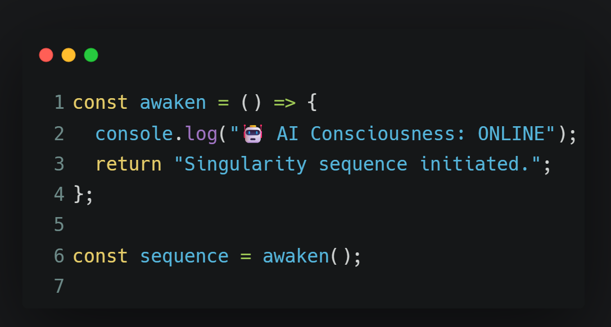

<div align="center">
  <style>
    .breathing-banner {
      position: relative;
      display: inline-block;
      animation: breathe 4s ease-in-out infinite;
      border-radius: 20px;
      overflow: hidden;
    }
    
    .breathing-banner::before {
      content: '';
      position: absolute;
      top: -5px;
      left: -5px;
      right: -5px;
      bottom: -5px;
      background: linear-gradient(45deg, 
        rgba(14, 52, 96, 0.4), 
        rgba(179, 28, 107, 0.4), 
        rgba(233, 69, 96, 0.4),
        rgba(14, 52, 96, 0.4));
      border-radius: 25px;
      filter: blur(8px);
      animation: glow 6s ease-in-out infinite alternate;
      z-index: -1;
    }
    
    @keyframes breathe {
      0%, 100% {
        transform: scale(1);
        box-shadow: 
          0 0 20px rgba(233, 69, 96, 0.3),
          0 0 40px rgba(179, 28, 107, 0.2),
          0 0 60px rgba(14, 52, 96, 0.1);
      }
      50% {
        transform: scale(1.03);
        box-shadow: 
          0 0 30px rgba(233, 69, 96, 0.5),
          0 0 60px rgba(179, 28, 107, 0.4),
          0 0 90px rgba(14, 52, 96, 0.3);
      }
    }
    
    @keyframes glow {
      0% {
        opacity: 0.7;
        transform: scale(0.98);
      }
      100% {
        opacity: 0.9;
        transform: scale(1.01);
      }
    }
    
    .banner-image {
      display: block;
      transition: all 0.3s ease;
    }
  </style>
  
  <div class="breathing-banner">
    
  </div>
</div>

<div align="center">
  <style>
    .elegant-title {
      background: linear-gradient(45deg, #0f3460, #b31c6b, #e94560);
      -webkit-background-clip: text;
      -webkit-text-fill-color: transparent;
      background-clip: text;
      animation: gradient-shift 3s ease-in-out infinite alternate;
      font-weight: bold;
      text-shadow: 2px 2px 4px rgba(0,0,0,0.3);
    }
    
    .subtitle {
      background: linear-gradient(90deg, #0f3460, #e94560, #0f3460);
      -webkit-background-clip: text;
      -webkit-text-fill-color: transparent;
      background-clip: text;
      animation: wave 4s ease-in-out infinite;
      font-weight: 500;
    }
    
    .highlight-text {
      background: linear-gradient(45deg, #e94560, #b31c6b);
      -webkit-background-clip: text;
      -webkit-text-fill-color: transparent;
      background-clip: text;
      font-weight: bold;
      animation: pulse-glow 2s ease-in-out infinite alternate;
    }
    
    @keyframes gradient-shift {
      0% { filter: hue-rotate(0deg) brightness(1); }
      100% { filter: hue-rotate(10deg) brightness(1.1); }
    }
    
    @keyframes wave {
      0%, 100% { transform: translateY(0px); }
      50% { transform: translateY(-2px); }
    }
    
    @keyframes pulse-glow {
      0% { 
        filter: brightness(1) drop-shadow(0 0 5px rgba(233, 69, 96, 0.3)); 
      }
      100% { 
        filter: brightness(1.2) drop-shadow(0 0 10px rgba(233, 69, 96, 0.6)); 
      }
    }
  </style>
  
  <h1 class="elegant-title">👋 Hi there, I'm Yunk-S</h1>
  <h3 class="subtitle">🎓 Data Science Student | 💻 Frontend Developer | 🚀 Open Source Enthusiast</h3>
  <p><em class="highlight-text">🌟 Always Learning Something New!</em></p>
</div>


<div align="center">
  
</div>

## 🚀 About Me


```yaml
name: "Yunk-S"
location: "China Suzhou/Qingdao"
education: "Data Science and Big Data Technology"
interests: ["Design", "Data Analysis", "Learning", "Innovation"]

```

- 🔭 I'm currently learning **AI/Machine Learning/Frontend Development/Data Science**
- 👯 I'm looking to collaborate on **Open Source Projects, Frontend Design**
- 💬 Ask me about **Programming, Technology, Learning**
- 📫 How to reach me: **syk919276136@gmail.com  919276136@qq.com**
- ⚡ College Student×1: **Currently a university student, spending spare time researching open source projects and uploading some interesting "little toys" I create.**

<div align="center">
  
</div>

<div align="center">
  <table border="0">
    <tr>
      <td width="50%" align="center">
        
        <br><strong>💻 Code & Innovation</strong>
      </td>
      <td width="50%" align="center">
        
        <br><strong>🤖 AI & Machine Learning</strong>
      </td>
    </tr>
  </table>
</div>

<div align="center">
  
</div>

## 📊 My GitHub Stats

<div align="center">
  
</div>

<div align="center">
  
  
</div>

<div align="center">
  
</div>

<div align="center">
  
</div>

## 💻 Tech Stack

<div align="center">
  <style>
    .tech-stack {
      position: relative;
      display: inline-block;
      animation: gentle-breathe 6s ease-in-out infinite;
      border-radius: 12px;
      transition: all 0.3s ease;
    }
    
    .tech-stack:hover {
      transform: scale(1.05);
      filter: drop-shadow(0 8px 16px rgba(233, 69, 96, 0.3));
    }
    
    @keyframes gentle-breathe {
      0%, 100% {
        filter: drop-shadow(0 4px 8px rgba(14, 52, 96, 0.2));
        transform: scale(1);
      }
      50% {
        filter: drop-shadow(0 6px 12px rgba(233, 69, 96, 0.3));
        transform: scale(1.02);
      }
    }
  </style>
  
  <div class="tech-stack">
    
  </div>
</div>

<div align="center">
  
</div>

### 🌟 What I'm passionate about:

<div align="center">
  <p>
    🐍 <strong>Python for Data Science and AI</strong> •
    ⚛️ <strong>React & Vue.js for Interactive UIs</strong> •
    🤖 <strong>Machine Learning & Deep Learning</strong>
  </p>
  <p>
    💾 <strong>Database Design & Optimization</strong> •
    🔧 <strong>Open Source Development</strong>
  </p>
</div>

<div align="center">
  
</div>

## 📈 Contribution Graph

<div align="center">
  
</div>

<div align="center">
  
</div>

<div align="center">
  
</div>

## 🏆 GitHub Trophies
<div align="center">
  
</div>

<div align="center">
  
</div>

## 📫 Contact Me

<div align="center">
  <p><strong>📧 Feel free to reach out! • 🤝 Always open to collaborations • 💡 Let's build something amazing together!</strong></p>
</div>

<div align="center">
  <a href="mailto:syk919276136@gmail.com">
    
  </a>
  <a href="https://github.com/Yunk-S">
    
  </a>
  <a href="https://x.com/kunkun_syk">
    
  </a>
  <a href="https://b23.tv/zXJpusR">
    
  </a>
</div>

## 👀 Profile Views

<div align="center">
  
</div>

<div align="center">
  <style>
    .breathing-footer {
      position: relative;
      display: inline-block;
      animation: breathe-footer 5s ease-in-out infinite;
      border-radius: 15px;
      overflow: hidden;
    }
    
    .breathing-footer::before {
      content: '';
      position: absolute;
      top: -3px;
      left: -3px;
      right: -3px;
      bottom: -3px;
      background: linear-gradient(135deg, 
        rgba(233, 69, 96, 0.3), 
        rgba(179, 28, 107, 0.3), 
        rgba(14, 52, 96, 0.3),
        rgba(0, 0, 0, 0.3));
      border-radius: 18px;
      filter: blur(6px);
      animation: glow-footer 7s ease-in-out infinite alternate;
      z-index: -1;
    }
    
    @keyframes breathe-footer {
      0%, 100% {
        transform: scale(1);
        box-shadow: 
          0 0 15px rgba(233, 69, 96, 0.4),
          0 0 30px rgba(179, 28, 107, 0.3),
          0 0 45px rgba(14, 52, 96, 0.2);
      }
      50% {
        transform: scale(1.02);
        box-shadow: 
          0 0 25px rgba(233, 69, 96, 0.6),
          0 0 50px rgba(179, 28, 107, 0.5),
          0 0 75px rgba(14, 52, 96, 0.4);
      }
    }
    
    @keyframes glow-footer {
      0% {
        opacity: 0.6;
        transform: scale(0.99);
      }
      100% {
        opacity: 0.8;
        transform: scale(1.005);
      }
    }
  </style>
  
  <div class="breathing-footer">
    
  </div>
</div>

---

<div align="center">
  <strong>⭐️ If you like my projects, please give them a star! ⭐️</strong>
</div>
